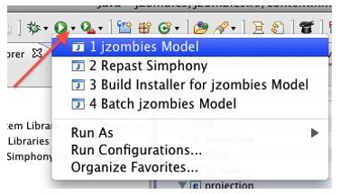
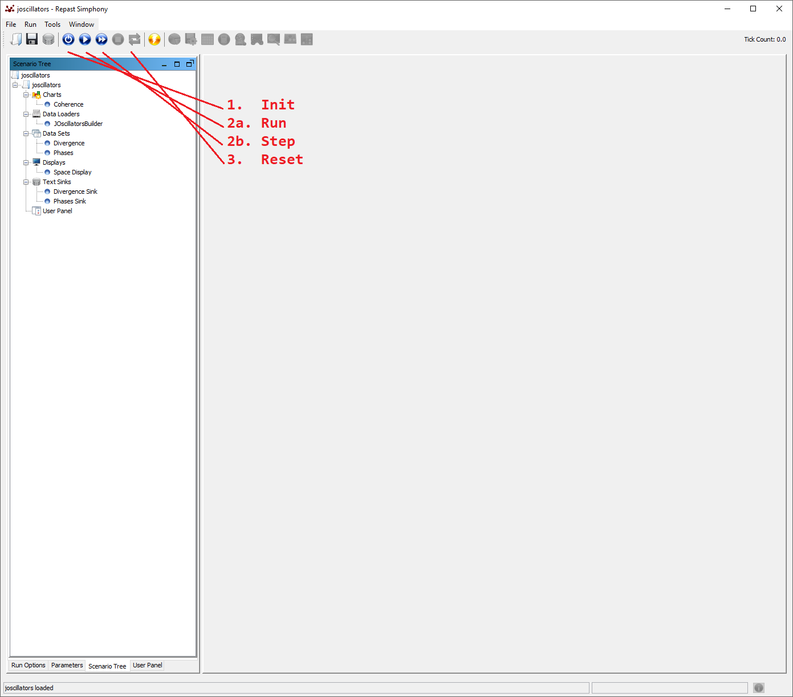

# Repast Oscillators
[Repast Symphony](https://repast.github.io/repast_simphony.html) synchronization models for coupled oscillators (such as [Kuramoto](http://tutorials.siam.org/dsweb/cotutorial/index.php?s=1&p=1))

## Useful Links:
- [Generative models of cortical oscillations: neurobiological implications of the Kuramoto model](https://www.frontiersin.org/articles/10.3389/fnhum.2010.00190/full)
- [Repast Symphony documentation](https://repast.github.io/docs.html)

## Getting Started
- Install Repast Symphony by following the instructions in the [official documentation page](https://repast.github.io/docs/RepastReference/RepastReference.html#_installation)
- Make sure you choose the "Repast Symphony" perspective
- Download extra dependencies needed by the joscillator project using `gradlew.bat copytolib` if Windows, `./gradlew copytolib` otherwise
- Checkout the repast-oscillators module inside your workspace
- Import the joscillator project
- Start the model GUI by selecting the "oscillator Model" launcher in the launcher selector window (click on the small downward facing triangle next to the Eclipse launcher button). The GUI may take a few seconds to appear.
  

## Running the Oscillator Model

- The phases and coherence for each tick are saved in out `output/phases.csv` and `output/coherence.csv` respectively.

